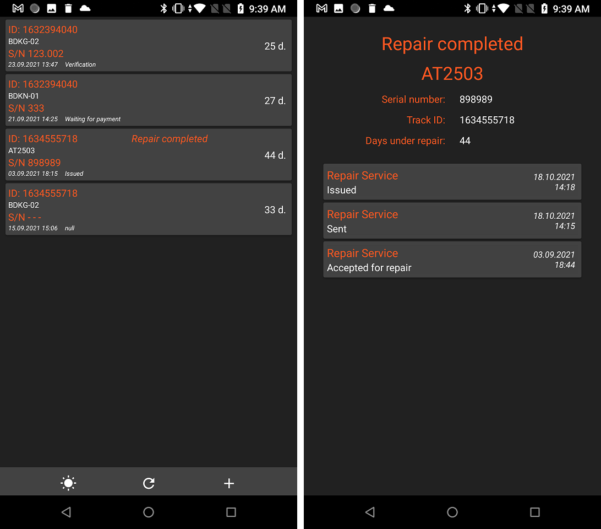

# Repairs Tracker 1.15
### <i>Отслеживание ремонтных устройств по его TrackId: статус, время, дата. Для внешнего применения, пользователи с помощью этого приложения смогут отслеживать, где находится их ремонтные устройства</i>

Особенности:
- Для хранения данных используется облачная NoSQL база данных Firestore Database. 

[Список версий](./VERSION.md)

[Скачать .apk последней версии - 1.15](./RepairsTracker-v1.15.apk)

